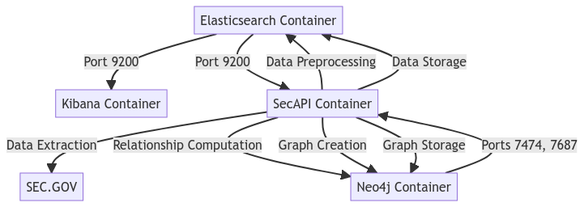

# SEC Filings Analysis with Elasticsearch, Kibana, and Neo4j

This project is a proof-of-concept (PoC) that demonstrates the use of Elasticsearch, Kibana, and Neo4j to analyze business descriptions extracted from SEC filings.

## Project Description

The aim of this project is to extract business descriptions from SEC filings, preprocess the extracted text, and then store and analyze the data using Elasticsearch, Kibana, and Neo4j. The analysis involves computing the cosine similarity between each pair of descriptions to determine how similar the businesses are to each other, and then storing the relationships in a graph database for easy retrieval and analysis.

| Epic | Description | Status |
| --- | --- | --- |
| Set up Elasticsearch | Set up the Elasticsearch service for storing and retrieving data. | :white_check_mark: |
| Set up Kibana | Set up the Kibana service for data visualization and user interface. | :white_check_mark: |
| Set up Neo4j | Set up the Neo4j service for graph database management. | :white_check_mark: |
| Build SEC API | Develop the SEC API for extracting data from SEC filings. | :white_check_mark: |
| Data Management | Move the data to the right places in the architecture. | :white_check_mark: |
| Docker Compose Setup | Set up the Docker Compose for managing the services. | :white_check_mark: |
| Find relationships based on SEC 10-K text similarity | Implement a feature that allows users to find relationships between companies based on the similarity of their SEC filings business description. | :white_check_mark: |
| Add dedicated user-facing Frontend | Develop a user interface where users can interact with the data and visualizations. This could be a web application that communicates with the backend services. | :large_blue_circle: |
| Include stock price data | Extend the data extraction process to include stock price data. This could involve integrating with a financial data API to retrieve stock prices for the companies. | Pending |
| Find relationships based on similar stock price behavior | Implement a feature that allows users to find relationships between companies based on similar stock price behavior through time series clustering. | Pending |

## Architecture

The architecture of this project consists of four Docker containers:

1. **Elasticsearch Container:** Runs the Elasticsearch service, which is used to store and retrieve the processed text data.

2. **Kibana Container:** Runs the Kibana service, which is used to visualize the data stored in Elasticsearch.

3. **Neo4j Container:** Runs the Neo4j service, which is used to store the relationships between the companies based on their similarity scores.

4. **SecAPI Container:** Runs a custom service that extracts the business descriptions from the SEC filings, preprocesses the text, stores the data in Elasticsearch, computes the relationships between the companies, and stores the graph in Neo4j.

## Communication

The communication between the containers is done through HTTP requests and the Bolt protocol. The Elasticsearch service is exposed on port 9200, the Kibana service on port 5601, and the Neo4j service on ports 7474 (for HTTP) and 7687 (for Bolt protocol).

## Modularity

The architecture is designed to be modular, with each service performing a specific task. This makes it easy to modify or replace a service without affecting the others.

## Scalability

The services are managed using Docker, which provides a consistent environment for the services to run in, regardless of the host system. Docker also makes it easy to scale the services, as you can simply start more containers to handle increased load.

## Usage

To use this project, you need to have Docker installed on your system. You can then clone the project repository, navigate to the project directory, and run `docker-compose up` to start the services. The data will be automatically extracted, processed, and stored in Elasticsearch and Neo4j, and you can use Kibana to visualize the data.

## Conclusion

This project demonstrates how Elasticsearch, Kibana, and Neo4j can be used together to analyze text data. The use of Docker makes it easy to manage the services and scale the project.
